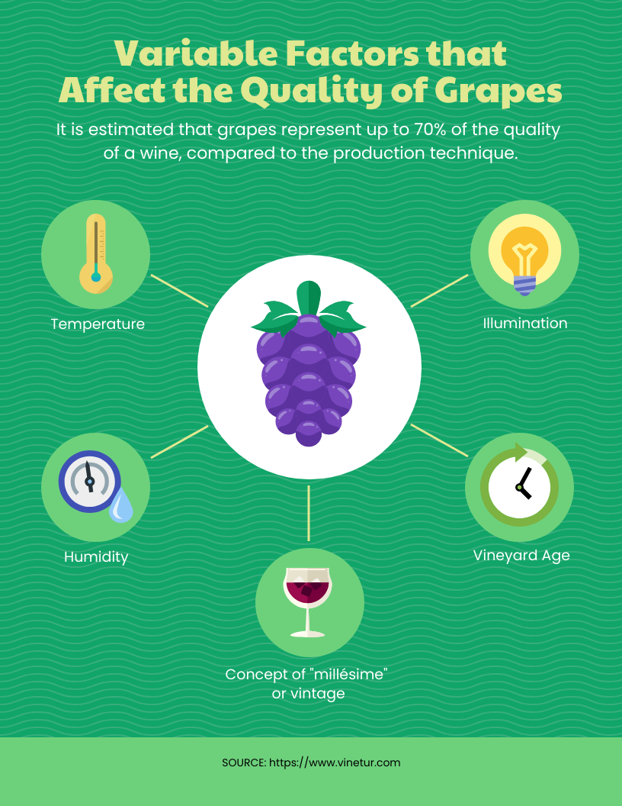

# Capstone 1: ML Zoomcamp

<p align="center" width="100%">
  
</p>


The goal of this project is to predict grape quality based on physical and environmental characteristics.

There are four categories of grape quality:

- Premium
- High
- Medium 
- Low

In order to create a prediction, the chosen dataset contains 1,000 observation and 13 features covering the following characteristics:

- Identification: Variety
- Geographic Origin: Region
- Quality Metrics: Sugar content, acidity
- Physical Characteristics: Cluster weight, berry size
- Environmental Factors: Harvest date, sun exposure, soil moisture, rainfall

> [!IMPORTANT]
To make the modeling aspect more challenging, the quality score feature was removed since it allowed for an almost perfect classification of the grapes.


# Project Structure (TBD)

```
├── Dockerfile
├── Pipfile
├── Pipfile.lock
├── README.md
├── artifacts
│   ├── df_test.csv
│   └── model.bin
├── data
│   └── GRAPE_QUALITY.csv
├── notebooks
│   └── notebook.ipynb
├── predict.py
├── score_results.py
└── train.py
```

## Clone the project

```
git clone https://github.com/ju-arroyom/capstone_ml_zoomcamp.git
```

## Dataset 

In the data subfolder, download the dataset from kaggle using the following commands:

```
curl -L -o $(pwd)/grape-quality.zip  https://www.kaggle.com/api/v1/datasets/download/mrmars1010/grape-quality

unzip grape-quality.zip 
```

## Conda Environment

```
conda create -n ml-zoomcamp python=3.11

conda install numpy pandas scikit-learn seaborn jupyter optuna pipenv
```

## Create Pipfile

```
pipenv install pandas==2.2.3 scikit-learn==1.6.0 flask gunicorn
```

## Docker

```
docker build -t grape_quality_prediction:v1 .
docker run -it --rm -p 8787:8787 grape_quality_prediction
```

# EDA

All the exploratory analysis can be found under notebook.ipynb.

In there, the original dataset was split into train/validation/test to:

- Analyze relationships between numerical and categorical features with target variable.

- Model selection and hyperparameter tuning

- Find the best algorithm and hyperparameters for our problem.

# Model Training


To train the final model, please run python train.py inside the conda environment.

This script will create the artifacts directory and store the model.bin file as well as df_test.csv.

Both files are required to run the scoring script.

# Scoring test results

From conda environment run the following command:

python score_results.py